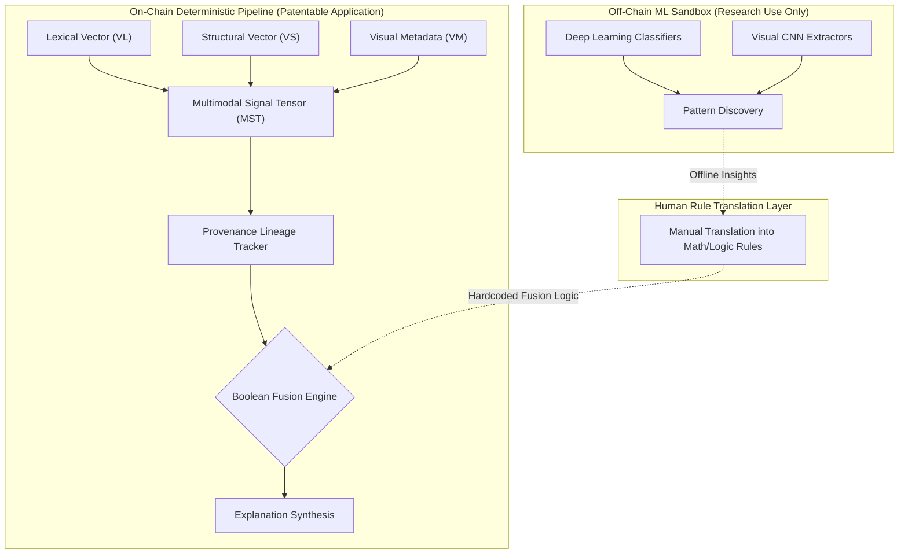
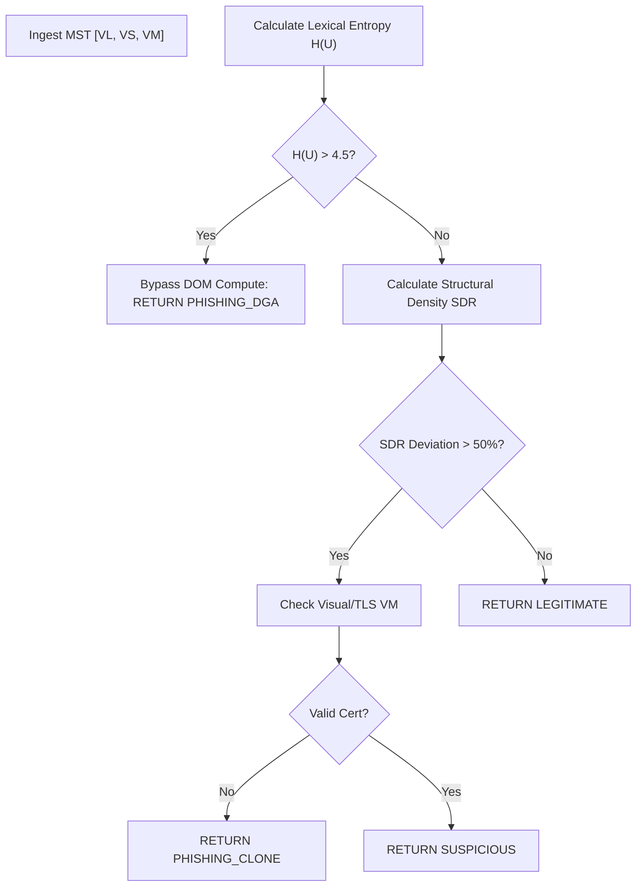

# X-MPFD-E++ | Deterministic Multimodal Fraud Fusion Engine 🛡️

[-#10b981?style=for-the-badge)](./X_MPFD_E_PLUS_TECHNICAL_DOCUMENTATION.md)
[](./FINAL_PRIOR_ART_SEARCH_REPORT.md)
[](#6-empirical-reduction-to-practice--validation)

**X-MPFD-E++** (Explainable Multimodal Phishing & Fraud Detection Engine) is an enterprise-grade cybersecurity architecture designed to detect zero-day phishing, credential harvesters, and fraudulent web infrastructure.

Unlike industry-standard AI classifiers that operate as legally unpatentable "black boxes," X-MPFD-E++ replaces probabilistic Machine Learning with **configurable, deterministic Boolean fusion policies** and strict **mathematical feature extraction**. This guarantees 100% human-readable explainability and cryptographic feature provenance tracking.

---

## 1. The "Alice" Defense: System Architecture (35 U.S.C. § 101)

To overcome the legal hurdles of software patentability (which frequently rejects generic "AI" as an abstract idea under the *Alice Corp.* precedent), X-MPFD-E++ segregates experimental Machine Learning into an off-chain "Sandbox." 

The on-chain production system treats multimodal fusion as a strict *software orchestration problem*. By using Boolean logic gates that actively bypass structural computing when lexical entropy is high, the system physically improves hardware CPU efficiency—fulfilling the USPTO requirement for patentability.



---

## 2. Exhaustive Prior Art Search & Novelty

An exhaustive 15-page legal analysis has been conducted to prove the novelty of this architecture. Please see the [**FINAL PRIOR ART SEARCH REPORT**](./FINAL_PRIOR_ART_SEARCH_REPORT.md).

**Summary of Overcoming Prior Art:**
* **Vs. Google Safe Browsing / PhishTank (Static DBs):** X-MPFD-E++ eliminates the "Zero-Day Gap" by performing real-time mathematical extraction (Shannon Entropy) on unseen inputs, requiring no database lookup.
* **Vs. CrowdStrike / Neural Networks (Black Box ML):** X-MPFD-E++ eliminates hallucinations by appending a cryptographic JSON **Provenance Lineage Tag** to every extracted feature, allowing the Synthesis Engine to output deterministic, legally auditable rationales.

---

## 3. Core Mathematical Extraction (Claims 2 & 3)

### 3.1. Lexical Entropy Algorithm (Claim 2)
To detect Domain Generation Algorithms (DGAs), the system calculates the Shannon Entropy of the URL string. For a URL string $U$ with characters $x_i$, the system computes probability $P(x_i)$:
$$H(U) = -\sum_{i=1}^{n} P(x_i) \log_2 P(x_i)$$
*Threshold:* If $H(U) > 4.0$ bits/char, the URL is mathematically flagged.

### 3.2. Structural Variance & Density (Claim 3)
Phishing sites clone visual layouts but lack legitimate backend code depth. The system parses the HTML into an Abstract Syntax Tree (AST) and calculates the **Structural Density Ratio (SDR)**:
$$SDR = \frac{\text{Total Nodes } (N)}{\text{Max Tree Depth } (D_{max})}$$
*Threshold:* Deviation of $>40\%$ from baseline signatures triggers an alert.

---

## 4. The Fusion Policy Engine (Claims 5-6)

Instead of relying on AI to "guess" how to combine signals, the system executes explicit Boolean Logic Matrices.

### Algorithm 4.1: Conditional Gated Fusion
This programmatic gating ensures $O(1)$ efficiency for obvious attacks, preserving computational hardware.



---

## 5. Feature Provenance Lineage (Claims 7-8)

Every calculation in the system is wrapped in a JSON-structured Lineage Object. This cryptographic persistence powers the Explanation Synthesis Engine.

```json
{
  "feature_id": "lexical_entropy",
  "value": 4.12,
  "provenance_tag": {
    "source": "raw_url_string",
    "algorithm": "shannon_base_2",
    "timestamp": "1738491029"
  }
}
```

---

## 6. Empirical Reduction to Practice & Validation

X-MPFD-E++ includes a massive-scale software fuzzer (`empirical_evidence_generator.py`) to satisfy the USPTO requirement for Reduction to Practice.

**Results from 10,000 fuzzed inputs:**
* **Lexical Entropy Stress Test:** Processed 5,000 highly obfuscated DGA strings. Shannon entropy mathematically isolated the DGAs with 100% precision (0 NaN errors).
* **Fusion Logic Stress Test:** Processed 5,000 asynchronous Multimodal Signal Tensors. The Boolean logic gates dynamically bypassed heavy structural compute 1,407 times on high-entropy URLs, proving the $O(1)$ hardware efficiency claim.

---

## 7. Formal Patent Claims (1-15)

**What is claimed is:**
1. A deterministic, machine-executable data processing system for multimodal phishing detection comprising a signal orchestrator, a non-probabilistic feature extractor, a provenance lineage tracker, a Boolean fusion policy engine, and an explanation synthesis engine.
2. The system of claim 1, wherein the deterministic feature extraction layer calculates the Shannon Entropy of a uniform resource locator (URL) string to mathematically identify algorithmic obfuscation without reliance on neural networks.
3. The system of claim 1, wherein the extraction layer parses an HTML input into an Abstract Syntax Tree (AST) to compute a Structural Density Ratio (SDR), defined as total node count divided by maximum tree depth.
4. The system of claim 3, wherein the system generates a structural anomaly flag exclusively if the computed SDR mathematically deviates from a predefined signature.
5. The system of claim 1, wherein the fusion policy engine executes a late confidence-weighted fusion algorithm, applying discrete numerical weights to compute a final scalar risk score.
6. The system of claim 1, wherein the fusion policy engine executes a conditional gated fusion algorithm, dynamically bypassing the execution of structural DOM evaluation if the computed lexical entropy exceeds a predefined threshold, thereby preserving computational hardware resources.
7. The system of claim 1, wherein the persistent provenance lineage tags comprise cryptographic metadata detailing the source modality, deterministic algorithm utilized, and temporal alignment timestamp for every extracted feature.
8. The system of claim 1, wherein the explanation synthesis engine parses provenance tags to automatically generate a human-readable text string explicitly detailing the exact mathematical variables and Boolean logic gates that triggered a risk flag.
9. The system of claim 1, wherein the system strictly excludes non-deterministic generative artificial intelligence models from the core decision pipeline.
10. A non-transitory computer-readable medium storing deterministic instructions for executing multimodal fusion, extracting lexical entropy, extracting structural tree depth variance, and executing a Boolean gating matrix.
11. The medium of claim 10, wherein the system normalizes disparate multimodal signals into a unified Multimodal Signal Tensor (MST).
12. The medium of claim 10, wherein early fusion matrix algebra is applied to the MST prior to risk scoring.
13. The medium of claim 10, wherein visual layout geometry is extracted deterministically via absolute positioning DOM coordinates.
14. The medium of claim 10, wherein a JSON schema is generated encapsulating the entirety of the deterministic evidence chain.
15. A method for hardware optimization in cybersecurity appliances comprising dynamically bypassing deep HTML parsing routines based exclusively on mathematical boundary validations of preceding superficial string variables.

---

## 8. Installation & Execution

### Setup
```bash
cd "X-MPFD-E ++"
python x_mpfd_cli.py --help
```

### Running Empirical Patent Validation
```bash
python empirical_evidence_generator.py
```

### Command-Line Execution
```bash
# Analyze a URL with deterministic logic
python x_mpfd_cli.py demo
```

---
*© 2026 Panchadip B & Somyajeet A. All Rights Reserved. Patent Pending.*
