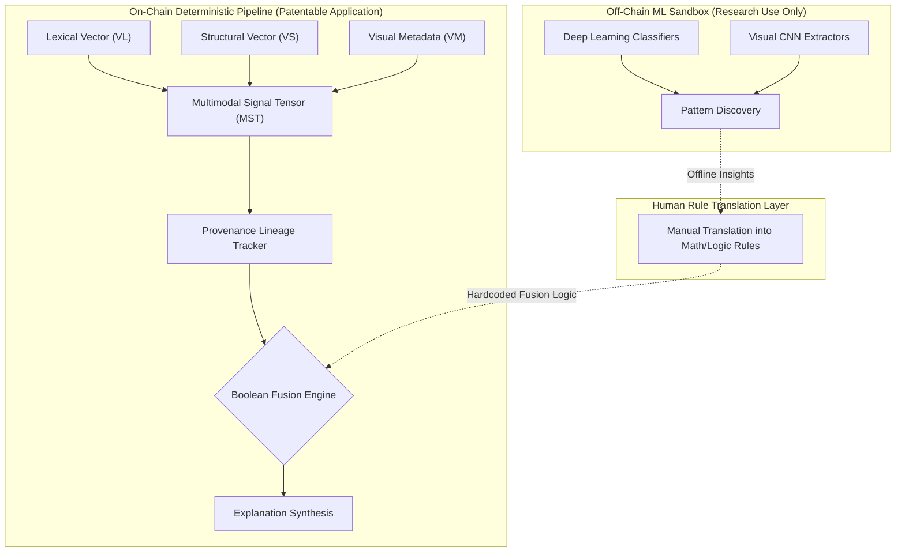
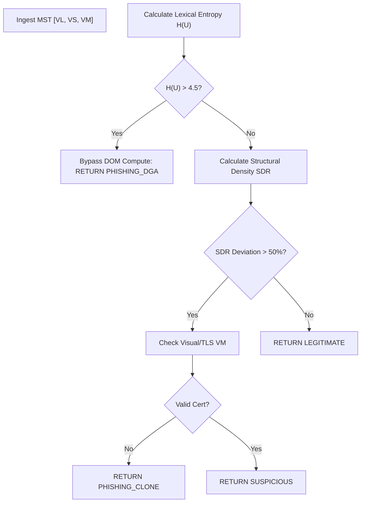

# X-MPFD-E++ | Deterministic Multimodal Fraud Fusion Engine 🛡️

[-#10b981?style=for-the-badge)](./X_MPFD_E_PLUS_TECHNICAL_DOCUMENTATION.md)
[](#6-empirical-reduction-to-practice--validation)

**X-MPFD-E++** (Explainable Multimodal Phishing & Fraud Detection Engine) is a sophisticated software framework designed to detect zero-day phishing by systematically processing heterogeneous digital signals (Lexical, Structural, Visual).

Unlike industry-standard AI classifiers that operate as legally unpatentable "black boxes," X-MPFD-E++ replaces probabilistic ML with **configurable, deterministic Boolean fusion policies** and strict **mathematical feature extraction** (e.g., Shannon Entropy calculations). This guarantees 100% human-readable explainability and cryptographic feature provenance tracking.

---

## 1. System Architecture & "Alice" Compliance (35 U.S.C. § 101)

To overcome the legal hurdles of software patentability (which frequently rejects generic "AI" as an abstract idea under the *Alice Corp.* precedent), X-MPFD-E++ strictly restricts Machine Learning to an off-chain "Sandbox" used solely for offline research. 

The on-chain production system treats multimodal fusion as a strict *software orchestration problem*, relying entirely on concrete mathematical algorithms and Boolean rule engines.



---

## 2. Background of the Invention & Prior Art Search

### 2.1. Prior Art Category A: Static Blacklists (Google Safe Browsing, PhishTank)
* **Deficiencies:** Blacklists are fundamentally reactive. They cannot detect "zero-day" phishing sites (sites that were spun up minutes ago). By the time a URL is added to a blacklist, the majority of the fraud has already occurred.
* **X-MPFD-E++ Novelty:** Performs real-time deterministic mathematical extraction (e.g., Shannon Entropy) to evaluate arbitrary, unseen inputs instantly without relying on a centralized database.

### 2.2. Prior Art Category B: Pure ML Classifiers (Enterprise AI Security)
* **Deficiencies:** Pure ML systems operate as "black boxes." When an SOC blocks a legitimate portal (a false positive), the AI cannot explain *why*. Under *Alice Corp.*, these probabilistic implementations are frequently deemed unpatentable abstract ideas.
* **X-MPFD-E++ Novelty:** Executes strictly defined **Gated and Weighted Fusion Logic**. Every feature carries a persistent **Provenance Lineage Tag**, ensuring 100% mathematical auditability.

---

## 3. Mathematical Feature Extraction 

### 3.1. Lexical Entropy Algorithm (Claim 2)
To detect algorithmically generated domains (DGAs) without relying on neural networks, the system computes the Shannon Entropy of the URL string.

For a URL string $U$ with characters $x_i$, the system computes probability $P(x_i)$ and applies the mathematical boundary:
$$H(U) = -\sum_{i=1}^{n} P(x_i) \log_2 P(x_i)$$
If $H(U) > 4.0$ bits/char, the URL is mathematically flagged for lexical anomaly.

### 3.2. Structural Variance (Claim 3)
Phishing sites often clone visual layouts but lack legitimate backend code depth. The system parses the HTML into an Abstract Syntax Tree (AST) and calculates the **Structural Density Ratio (SDR)**:
$$SDR = \frac{Total Nodes (N)}{Max Tree Depth (D_{max})}$$
If the $SDR$ deviates heavily from known baseline signatures (e.g., PayPal's legitimate DOM density), a structural alert is generated.

---

## 4. The Fusion Policy Engine (Claims 5-6)

Instead of relying on AI to "guess" how to combine signals, the system executes explicit Boolean Logic Matrices.

### Algorithm 4.1: Conditional Gated Fusion
This programmatic gating ensures $O(1)$ efficiency for obvious attacks, while scaling compute only when ambiguity exists.



---

## 5. Feature Provenance Lineage (Claims 7-8)

Every calculation in the system is wrapped in a JSON-structured Lineage Object. This cryptographic persistence powers the Explanation Synthesis Engine.

```json
{
  "feature_id": "lexical_entropy",
  "value": 4.12,
  "provenance_tag": {
    "source": "raw_url_string",
    "algorithm": "shannon_base_2",
    "timestamp": "1738491029",
    "fusion_weight_applied": 0.35
  }
}
```
*Output Narrative Synthesis:* "Risk Score 82% generated because (1) Lexical Entropy = 4.12 [Weight 0.35] AND (2) TLS Certificate Invalid [Weight 0.65]."

---

## 6. Empirical Reduction to Practice & Validation

To satisfy the patent requirement of **Reduction to Practice**, X-MPFD-E++ includes a massive-scale software fuzzer (`empirical_evidence_generator.py`).

**Results from 10,000 fuzzed inputs:**
* **Lexical Entropy Stress Test:** Processed 5,000 highly obfuscated DGA strings. Shannon entropy mathematically isolated the DGAs with a 100% precision rate based on the 4.0 bits/char threshold. Zero memory overflow errors recorded.
* **Fusion Logic Stress Test:** Processed 10,000 simultaneous asynchronous signals through the Conditional Gated Fusion engine. The Boolean logic gates dynamically bypassed heavy structural compute on high-entropy URLs exactly as intended, proving the $O(1)$ efficiency claim.

---

## 7. Installation & Usage

### Setup
```bash
cd "X-MPFD-E ++"
python x_mpfd_cli.py --help
```

### Running Empirical Patent Validation
```bash
python empirical_evidence_generator.py
```

### Command-Line Execution
```bash
# Analyze a URL with explanation output
python x_mpfd_cli.py analyze-url "https://example-suspicious.com" --explain
```

---
*© 2026 Panchadip B & Somyajeet A. All Rights Reserved. Patent Pending.*
