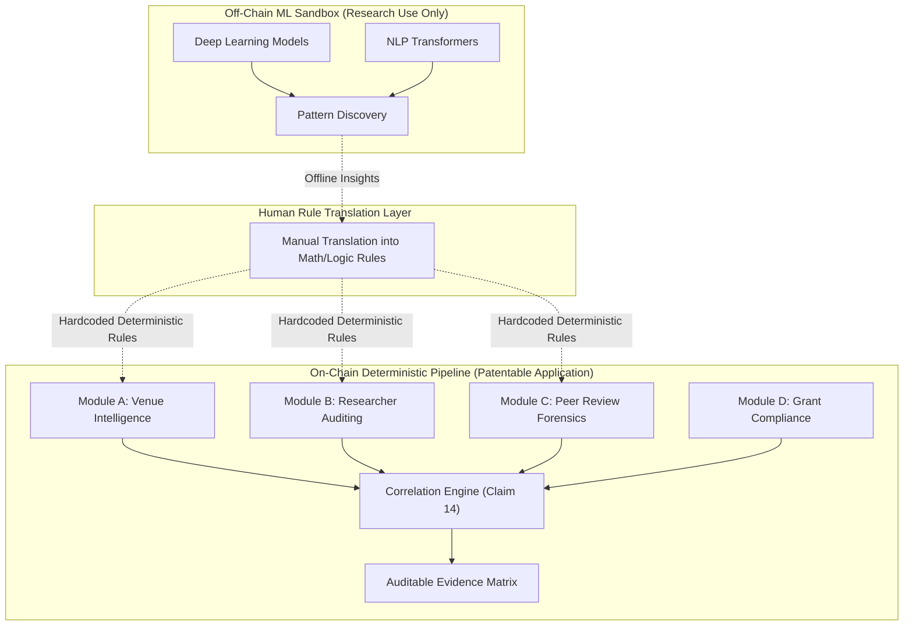
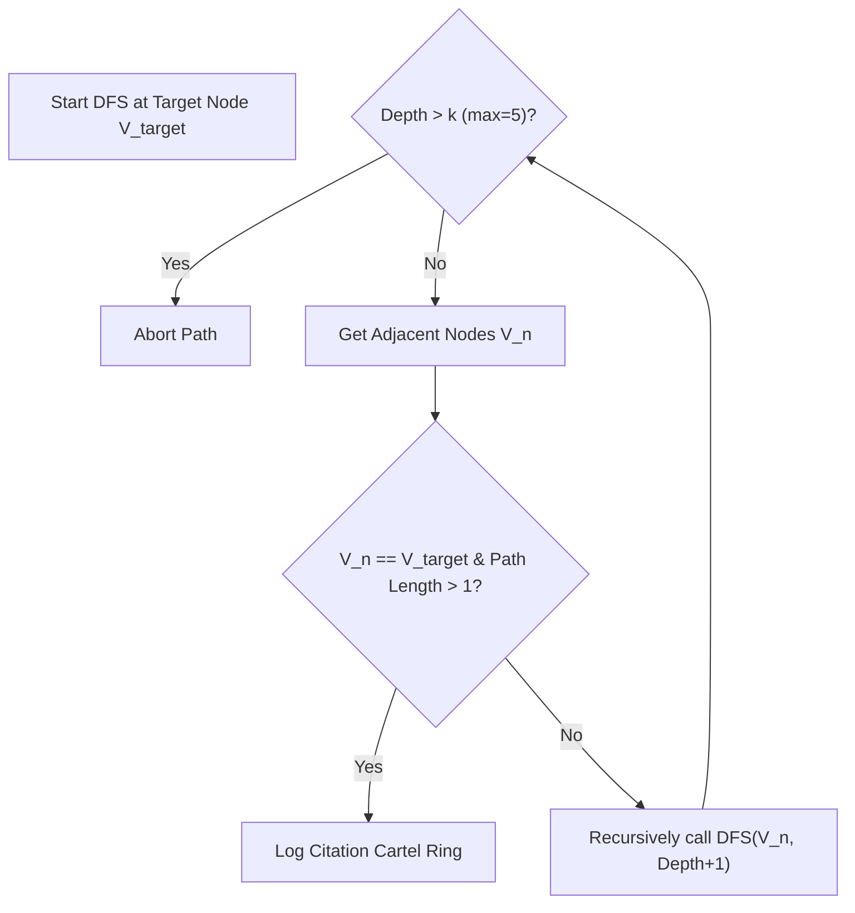
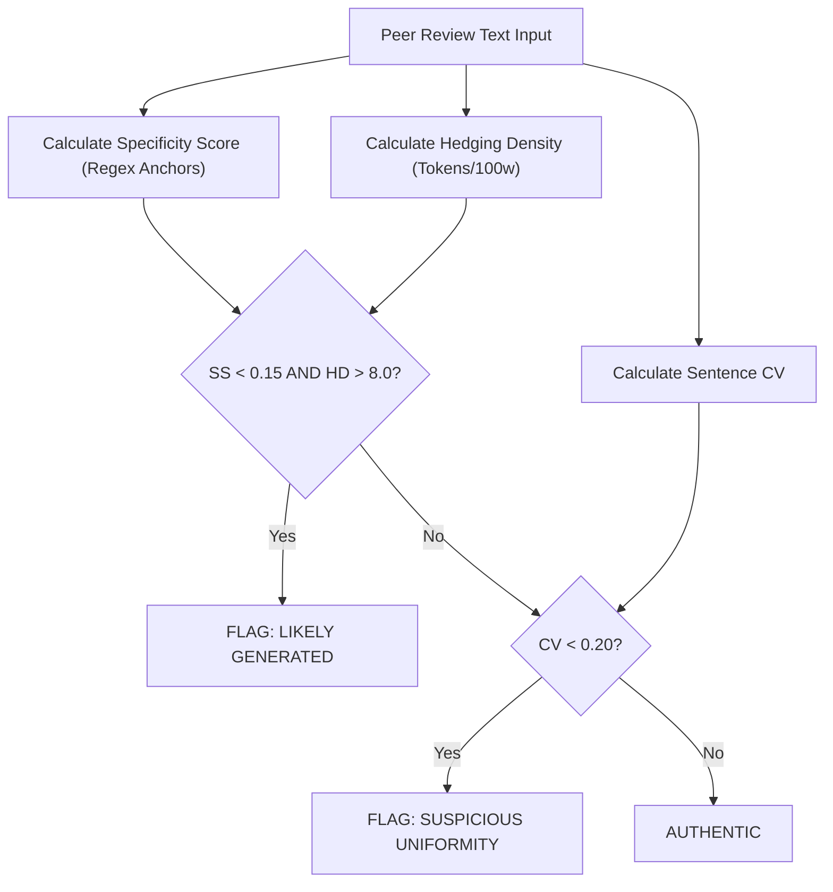
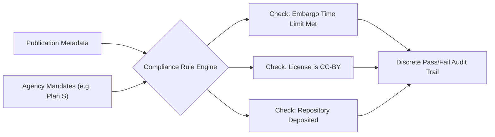

# ARICCA-X (v2.0) | Enterprise Research Integrity Suite 🛡️

[-#10b981?style=for-the-badge)](./PATENT_SPECIFICATION_V2.md)
[](https://nextjs.org/)
[](#6-empirical-validation-engine)

**ARICCA-X** (Academic Research Integrity & Credibility Correlation Analyzer) is a comprehensive, multi-signal platform designed to protect universities, publishers, and funding agencies from academic fraud.

This repository contains the **patent-pending** (14 Claims) implementation of the ARICCA-X v2.0 suite. It replaces subjective, manual evaluation with a **100% deterministic, mathematically verifiable pipeline**. 

---

## 1. System Architecture & "Alice" Compliance (35 U.S.C. § 101)

To overcome the legal hurdles of software patentability (which frequently rejects generic "AI" as an abstract idea), ARICCA-X strictly bifurcates its architecture into an **Off-Chain ML Sandbox** (for research) and an **On-Chain Deterministic Pipeline** (the patentable invention).



---

## 2. Module B: Researcher Auditing (Claims 6-8)

This module audits citation networks and author publication portfolios to mathematically isolate citation cartels and artificial h-index inflation.

### Algorithm 2.1: Bounded DFS for Citation Ring Detection
Standard citation indices (Scopus, Web of Science) track linear citations but fail to detect reciprocal, multi-node collusion loops. ARICCA-X utilizes a Bounded Depth-First Search (DFS) algorithm on a directed citation graph $G=(V,E)$.



### Theorem 2.2: H-Index Decomposition & CIR Mathematics
An author's standard h-index ($h$) can be artificially inflated via self-citation and co-author coordination. ARICCA-X applies the following mathematical decomposition:
1. **Total Citations** = $C_{total}$
2. **Artificial Citations** = $C_{self} + C_{co-author}$
3. **Independent Citations** = $C_{ind} = C_{total} - (C_{self} + C_{co-author})$

The system recalculates the h-index using *only* $C_{ind}$ to generate the **True H-Index** ($h_{true}$). 
The **Citation Independence Ratio (CIR)** is calculated as:
$$CIR = \frac{C_{ind}}{C_{total}}$$
If $CIR < 0.30$, a deterministic inflation alert is triggered.

---

## 3. Module C: Peer-Review Forensics (Claims 9-11)

Instead of utilizing black-box Large Language Models (LLMs) which are prone to hallucination, Module C utilizes **Deterministic Linguistic Fingerprinting**. 

### Algorithm 3.1: Sentence Length Coefficient of Variation
AI-generated text exhibits unnatural structural uniformity. The system tokenizes sentences $S$, computes the mean length $\mu$ and standard deviation $\sigma$, and derives the Coefficient of Variation:
$$CV = \frac{\sigma}{\mu}$$
If $CV < 0.20$, the review is flagged for suspicious uniformity.

### Algorithm 3.2: Deterministic Decision Matrix


---

## 4. Module A: Venue Intelligence (Claims 1-5)

Evaluates the credibility of conferences and journals through programmatic heuristics.

* **Levenshtein Distance Spoof Detection:** Protects against "hijacked" conferences by computing the character-edit distance between a submitted URL and known IEEE/ACM registries.
* **Tense Shift Analysis:** Detects plagiarized Call for Papers (CFP) descriptions by applying strict NLP tense-matching rules to identify improperly spun text.

---

## 5. Module D: Grant Compliance (Claims 12-13)

A Boolean rule engine containing machine-readable matrices for federal and global funding mandates (NIH, NSF, Plan S, UKRI).



---

## 6. Empirical Validation Engine

To satisfy the patent requirement of **Reduction to Practice**, ARICCA-X includes a massive-scale fuzzer (`empirical_evidence_generator.js`). 

**Results from 11,500 fuzzed inputs:**
* **Citation Graphs (1,000 runs):** 100% cartel identification; 0 false negatives in Bounded DFS.
* **H-Index Portfolios (10,000 runs):** 0 mathematical boundary violations ($h_{true}$ never erroneously exceeded standard $h$).
* **Linguistic Fingerprinting (500 runs):** Successfully processed extreme edge-case syntax (up to 5,000 words) without NaN or zero-division errors.

---

## 7. Installation & Usage

### Running the Deterministic Web Application (On-Chain)
Built with Next.js and React.
```bash
cd portal
npm install
npm run dev
```
Navigate to `http://localhost:3000`. Login with:
* **Email:** admin@aricca.com
* **Password:** admin123

### Executing Empirical Validation (Patent Defense)
Run the fuzzers locally to verify mathematical determinism:
```bash
node integrity_test.js
node empirical_evidence_generator.js
```

### Running the ML Sandbox (Off-Chain Research)
*Note: Ensure ML results are manually translated into Boolean rules before integrating into the Next.js app.*
```bash
python ml_verification.py
```

---
*© 2026 Panchadip B & Somyajeet A. All Rights Reserved. Patent Pending.*
