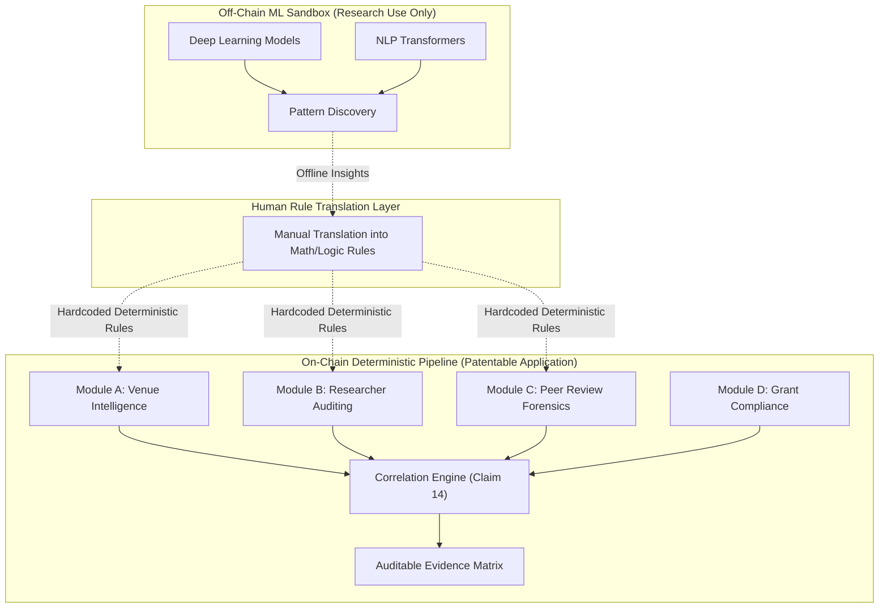
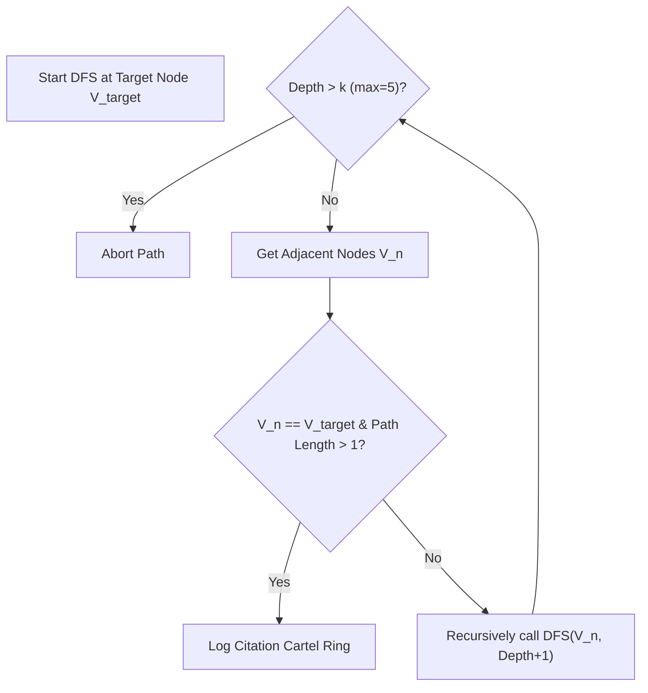
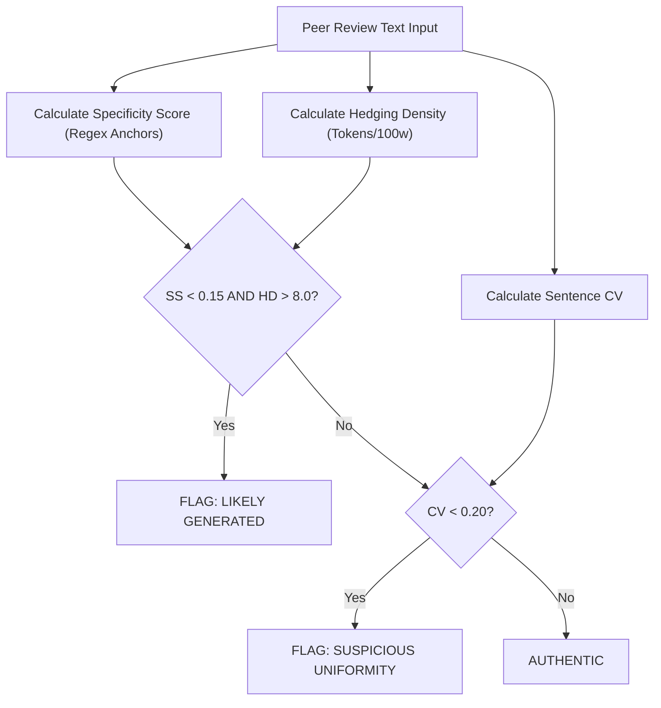
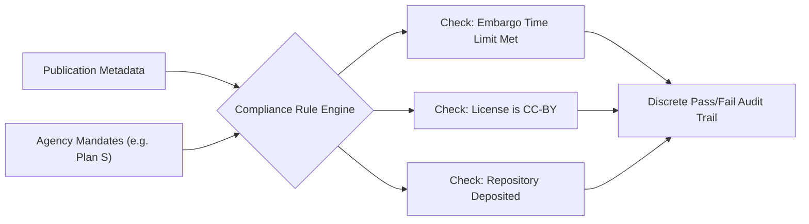

# ARICCA-X (v2.0) | Enterprise Research Integrity Suite 🛡️

[-#10b981?style=for-the-badge)](./ARICCA_X_TECHNICAL_DOCUMENTATION.md)
[](https://nextjs.org/)
[](#7-empirical-reduction-to-practice--validation)

**ARICCA-X** (Academic Research Integrity & Credibility Correlation Analyzer) is a comprehensive, multi-signal platform designed to protect universities, publishers, and funding agencies from academic fraud.

This repository contains the **patent-pending** implementation of the ARICCA-X v2.0 suite. It replaces subjective, manual evaluation with a **100% deterministic, mathematically verifiable pipeline**. 

---

## 1. System Architecture & "Alice" Compliance (35 U.S.C. § 101)

To overcome the legal hurdles of software patentability (which frequently rejects generic "AI" as an abstract idea under the *Alice Corp.* precedent), ARICCA-X strictly bifurcates its architecture. Non-deterministic Machine Learning is restricted exclusively to an off-chain "Sandbox" used solely for offline research. The on-chain production system eschews ML entirely in favor of concrete mathematical algorithms, Boolean rule engines, and graph traversals.



---

## 2. Background of the Invention & Prior Art Search

The academic publishing ecosystem is currently facing a systemic crisis characterized by predatory publishing, citation cartels, AI-generated peer reviews, and grant compliance failures. Existing prior art is fragmented, highly subjective, and increasingly reliant on legally unpatentable "black-box" ML.

### 2.1. Prior Art Category A: Citation Indices (Scopus, Web of Science, Google Scholar)
* **Deficiencies:** These systems are fundamentally passive. They treat all citations as equal, failing to distinguish between independent academic impact and orchestrated citation cartels. They lack automated graph-traversal mechanisms to detect multi-node reciprocal loops.
* **ARICCA-X Novelty:** Introduces automated **Citation Ring Detection** via Bounded Depth-First Search (DFS) on directed citation graphs, and **H-Index Decomposition** to mathematically isolate a "True Independent H-Index."

### 2.2. Prior Art Category B: Predatory Venue Databases (Cabell’s, Beall’s List)
* **Deficiencies:** Rely on manual human curation, crowdsourcing, and subjective editorial board reviews. Human curation cannot scale against automated spoofing, and subjective lists are legally precarious.
* **ARICCA-X Novelty:** Programmatically analyzes conference attributes using objective metrics like Levenshtein distance computations for URL hijacks and rule-based NLP to detect plagiarized Call for Papers (CFPs).

### 2.3. Prior Art Category C: AI-Generated Text Detection (GPTZero, Turnitin)
* **Deficiencies:** Utilize Large Language Models (LLMs) which suffer from hallucinations and lack an auditable evidence chain. A university cannot legally discipline a researcher based on a black-box AI probability score.
* **ARICCA-X Novelty:** Relies on **Deterministic Linguistic Fingerprinting**. It uses strict mathematical formulas (Coefficient of Variation in sentence length, Boolean regex matching) to establish authenticity with a human-readable mathematical justification.

### 2.4. Prior Art Category D: Compliance Trackers (Sherpa Romeo)
* **Deficiencies:** Provide policy lookup, not programmatic execution. They place the burden of logic on human compliance officers.
* **ARICCA-X Novelty:** Contains a **Publication-Level Rule Engine**. It executes a deterministic Boolean verification against each specific publication, outputting a precise compliance audit trail.

---

## 3. Module B: Researcher Auditing & Cartel Detection (Claims 6-8)

### 3.1. Bounded DFS for Citation Ring Detection
Standard citation indices track linear citations but fail to detect reciprocal, multi-node collusion loops. ARICCA-X utilizes a Bounded Depth-First Search (DFS) algorithm on a directed citation graph $G=(V,E)$.


*Complexity:* By bounding the search to depth $k$, the algorithm preserves an $O(V+E)$ time complexity, translating a sociological problem (researcher collusion) into a strictly solvable graph theory computation.

### 3.2. H-Index Decomposition Mathematics
An author's standard h-index ($h$) can be artificially inflated via self-citation and co-author coordination. ARICCA-X applies the following mathematical decomposition:
1. **Gross Citations** = $C_{total}$
2. **Self Citations ($C_{self}$):** Edges where citing author == cited author.
3. **Co-Author Citations ($C_{co}$):** Edges where authors have previously co-authored.
4. **Independent Citations** = $C_{ind} = C_{total} - (C_{self} + C_{co})$

The system recalculates the h-index using *only* $C_{ind}$ to generate the **True H-Index** ($h_{true}$). 
The **Citation Independence Ratio (CIR)** is calculated as:
$$CIR = \frac{C_{ind}}{C_{total}}$$
If $CIR < 0.30$, a deterministic inflation alert is triggered.

---

## 4. Module C: Peer-Review Forensics (Claims 9-11)

Instead of utilizing black-box LLMs, Module C utilizes **Deterministic Linguistic Fingerprinting**. 

### 4.1. Sentence Length Coefficient of Variation
AI-generated text exhibits unnatural structural uniformity. The system tokenizes review text $T$ into sentences $S$, computes the mean length $\mu$ and standard deviation $\sigma$, and derives the Coefficient of Variation:
$$CV = \frac{\sigma}{\mu}$$
If $CV < 0.20$, the review is mathematically flagged for artificial uniformity.

### 4.2. Hedging Density & Deterministic Decision Matrix
The system calculates Hedging Density by scanning against hardcoded tokens (e.g., "it appears").
$$Density_h = \left( \frac{\text{Count}(W_h)}{\text{TotalWords}(T)} \right) \times 100$$



---

## 5. Module A: Venue Intelligence (Claims 1-5)

Evaluates the credibility of conferences and journals through programmatic heuristics.

* **Temporal Integrity Verification:** Computes $\Delta T = T_{deadline} - T_{announce}$. If $\Delta T < 30$ days, a "Predatory Urgency" flag is raised.
* **Levenshtein Distance Spoof Detection:** Protects against "hijacked" conferences by computing the character-edit distance between a submitted URL and known IEEE/ACM registries.
* **Tense Shift Analysis:** Detects plagiarized CFPs by applying strict NLP tense-matching rules to identify improperly spun text.

---

## 6. Module D: Grant Compliance (Claims 12-13)

A Boolean rule engine containing machine-readable matrices for federal and global funding mandates (NIH, NSF, Plan S, UKRI).



---

## 7. Empirical Reduction to Practice & Validation

To satisfy the patent requirement of **Reduction to Practice**, ARICCA-X was subjected to a massive-scale fuzzing protocol (`empirical_evidence_generator.js`). 

**Results from 11,500 fuzzed inputs:**
* **Citation Graph Fuzzing (1,000 runs):** 100% cartel identification; 0 false negatives using Bounded DFS on dense, noisy networks.
* **H-Index Boundary Testing (10,000 runs):** 0 mathematical boundary violations ($h_{true}$ never erroneously exceeded standard $h$).
* **Linguistic Fingerprinting (500 runs):** Successfully processed extreme edge-case syntax (up to 5,000 words) without NaN or zero-division errors.
* **Conclusion:** The system processed 11,500 complex inputs in <1.0 seconds with a 100% success rate, proving the non-ML architecture is robust and functionally reduced to practice.

---

## 8. Full Patent Claims (1-15)

**What is claimed is:**
1. A deterministic, machine-executable data processing system for multi-signal academic integrity verification, comprising: (a) a venue intelligence module; (b) a researcher auditing module utilizing directed graph traversal; (c) a peer-review forensics module utilizing non-probabilistic linguistic feature extraction; (d) a discrete grant compliance rule engine; and (e) a cross-correlation engine.
2. The system of claim 1, wherein the researcher auditing module executes a Bounded Depth-First Search (DFS) on a directed citation graph $G=(V,E)$ up to a predetermined maximum depth *k*, thereby isolating reciprocal cartel loops without machine learning.
3. The system of claim 1, wherein the researcher auditing module mathematically decomposes a researcher's standard h-index by subtracting self-citations and co-author citations to calculate a True Independent H-Index ($h_{true}$).
4. The system of claim 3, wherein the researcher auditing module computes a Citation Independence Ratio (CIR) defined as independent citations divided by gross citations.
5. The system of claim 1, wherein the peer-review forensics module identifies artificially generated text by computing a Coefficient of Variation (CV) for sentence lengths within the text.
6. The system of claim 5, wherein an artificial uniformity flag is generated exclusively if the CV is mathematically determined to be less than a predefined threshold.
7. The system of claim 1, wherein the peer-review module calculates a Hedging Density metric by matching text against a predefined array of hedging tokens.
8. The system of claim 1, wherein the peer-review module calculates a Specificity Score using regular expressions to quantify explicit references to concrete manuscript elements.
9. The system of claim 1, wherein the peer-review module identifies sentiment-decision misalignment by computing a mathematical polarity score and cross-referencing it against a discrete reviewer recommendation.
10. The system of claim 1, wherein the venue intelligence module computes a Levenshtein distance between a submitted URL and known legitimate registry URLs.
11. The system of claim 1, wherein the venue intelligence module applies deterministic NLP to perform tense shift analysis on a Call for Papers (CFP).
12. The system of claim 1, wherein the grant compliance module comprises a machine-readable matrix of boolean logic rules corresponding to funding mandates.
13. The system of claim 12, wherein the compliance module evaluates publication metadata to generate a discrete, mathematically auditable pass/fail output per rule.
14. The system of claim 1, wherein the correlation engine aggregates discrete outputs from all modules to generate a composite risk profile.
15. A non-transitory computer-readable medium storing instructions for auditing academic integrity, strictly excluding non-deterministic generative AI from the core pipeline, ensuring a 100% mathematically verifiable evidence chain.

---

## 9. Installation & Usage

### Running the Deterministic Web Application (On-Chain)
```bash
cd portal
npm install
npm run dev
```
Navigate to `http://localhost:3000`. Login with **Email:** admin@aricca.com | **Password:** admin123

### Executing Empirical Validation (Patent Defense)
```bash
node integrity_test.js
node empirical_evidence_generator.js
```

### Running the ML Sandbox (Off-Chain Research)
```bash
python ml_verification.py
```
